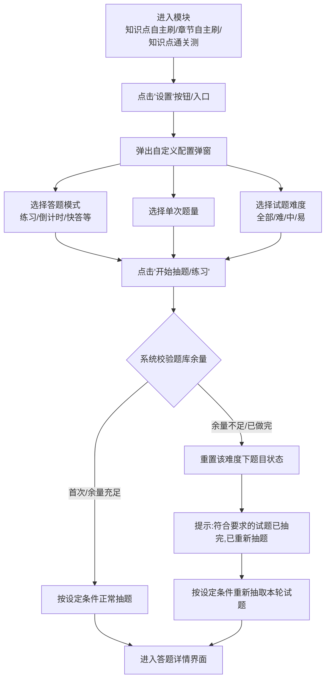

# 天一云校园-刷题及测试模块重构 PRD

## 1. 需求背景
随着天一云校园业务的发展，用户在题库刷题和测试场景下的需求逐渐细化。当前的练习模块缺乏清晰的场景隔离，无法满足用户对“知识点/章节”层级和“套卷/章节组卷”层级的不同诉求；同时缺乏难度选择、丰富的答题模式以及个性化的抽题配置。为了提升用户的备考效率和学习体验，亟需对现有刷题模块进行架构拆分、体验升级和逻辑重构。

## 2. 需求目标
1. **重构界面架构**：将整体页面视觉和交互在宏观上划分为大两块：“知识点刷题与测试” + “试卷刷题”。
2. **重塑练习模式**：通过新增“模式设置通用弹窗”，提供多维度的练习配置（包括答题模式、题量、难度隔离），满足不同场景诉求。
3. **完善与更名模块**：新增“章节速刷”模块，并对现有“知识点通关练”、“专项突破练习”等模块进行合理化更名与逻辑解耦。

## 3. 产品概述
本次迭代核心在于“分类”与“精细化配置”。
界面的顶层设计将隔离“知识点相关的练习与测试”与“套卷/试卷类的刷题”。
在底层抽题逻辑上，重点引入了基于认知难度的抽题规则（难、中、易），并辅以6种不同的答题和考试模式，全面覆盖用户日常刷题、考前冲刺、错题背诵等学习场景。

## 4. 用户故事
- **作为一名备考学生**，我希望在“套卷速刷”中能按年份排序试卷，以便我能先做最新的真题或按顺序做历年真题。
- **作为一名基础薄弱的学生**，我希望在章节练习时能够自主选择“易”难度的题目进行过滤，并使用“背题模式”直接看答案解析，以便快速掌握基础。
- **作为一名自我检测的学生**，我希望能够无限制地点击知识点树上的任意节点进行测试，而不是被前置未通过的节点卡住。
- **作为一名复习阶段的学生**，我希望每天能在题库抽取20道难度为“中”的题进行快答，当这些题做完后，系统能重新把这批题拿出来让我二次巩固。

## 5. 核心流程

### 5.1 刷题设置与抽题核心流程

### 5.2 套卷速刷排序流程

## 6. 功能需求

### 6.1 模块更名与界面架构调整

| 功能模块 | 原始名称/状态 | 新名称/状态 | 详细说明 | 优先级 |
| --- | --- | --- | --- | --- |
| 整体布局 | 混合展示 | 知识点的刷题和测试 + 试卷的刷题 | 页面按两大板块进行UI隔离与聚类分组，形成视觉上的区域划分，降低认知负荷。 | 高 |
| 模块：知识点自主刷 | 新增/独立 | **知识点自主刷** | 实际调用原题库中的知识点练习逻辑； 需从“知识点通关测”内部剥离原先的“自由练习”功能至本模块。 | 高 |
| 模块：章节自主刷 | 章节自主练习 | **章节自主刷** | 仅更名，继承原有章节维度的练习属性。 | 高 |
| 模块：知识点通关测 | 知识点通关练 | **知识点通关测** | 1. 更名。 2. 取消上下层级闯关限制，允许跨层级点击。 3. 视觉状态调整：测试达标（掌握）的节点高亮置彩，未达标/未做的节点置灰。 | 高 |
| 模块：章节速刷 | 暂无 | **章节速刷** | 1. 新增功能模块，在UI上与“套卷速刷”平行。 2. 业务属性上属于【试卷】模块，对接后端新增的试卷分类数据流。 | 中 |
| 模块：AI薄弱突破练 | 专项突破练习 | **AI薄弱突破练** | 仅名称变更，前端文案修改。 | 中 |

### 6.2 练习模式设置系统 (通用组件)

应用于【知识点自主刷】、【章节自主刷】、【知识点通关测】三个模块。

| 模块区域 | 字段/选项 | 交互逻辑/说明 |
| --- | --- | --- |
| 触发入口 | 筛选栏/浮窗区域 | 需要在各支持模块列表页增加“难度偏好快捷入口(难/中/易)”与“全局设置齿轮”按钮。 |
| 弹窗：答题模式 | 练习模式 / 考试计时模式 / 考试倒计时模式 / 快答模式 / 背题模式 / 答题模式 | **练习模式**：答一题对一题出解析； **倒计时/计时模式**：交卷后出成绩解析； **背题模式**：直接呈现正确答案与解析； **快答模式**：简化交互，快速滑动切题。 |
| 弹窗：题量设置 | 文本输入/步进器 | 允许用户自定义单次抽取的题目数量（边界：1 ~ 最大系统支持数，如50或100）。 |
| 弹窗：动画开关 | Switch组件 | 针对“练习模式”等控制是否展示过场动画特效。 |
| 弹窗：难度设置 | 全部 / 难 / 中 / 易 | - **全部**(默认)：按常规乱序或权重抽取。 - **特定难度**：严格过滤所选难度（前端需展示当前选择的标签状态）。 |
| 抽题核心规则 | 难度库存不足 | 如果用户选择特定难度（如：易），但该知识点下“易”题目用户已全部作答完毕，触发重新抽题逻辑： 1. 重置这些题目的前端作答历史标记。 2. 从头再次抽取一遍这批题目。 3. 并在进入答题页时弹窗/Toast提示：`“符合要求的试题已抽完，已重新抽题”`。 |

### 6.3 套卷速刷列表排序

| 功能元素 | 业务逻辑 |
| --- | --- |
| 排序按钮 | 默认文案或图标展示当前排序状态。 点击顺序切换循环：`默认(后台排序字段)` -> `年份(新到旧)` -> `年份(旧到新)` -> `默认` |

## 7. 非功能需求

1. **性能需求**
   - 模式设置弹窗要求秒开（基于前端本地组件渲染）。
   - 重新抽题并重置旧题作答状态时，要求服务端API响应时间低于 `500ms`，不能产生明显卡顿感。
2. **兼容性需求**
   - 前端UI在两栏/分区（知识点侧+试卷侧）重构下，需兼容主流移动端机型（特别是异形屏/折叠屏），确保“设置面板”不会引起溢出。

## 8. 风险评估

| 风险项 | 风险描述 | 规避/应对策略 |
| --- | --- | --- |
| **抽题逻辑死循环风险** | 若某知识点库中本身没有“难”题，用户却强行筛选“难”，抽题接口可能报错或不断重试。 | 后端接口查询前需校验该难度库的总数量，若总数为0，则直接提示“该节点暂无符合难度的试题”，拦截发起抽题动作。 |
| **闯关状态同步异常** | 【知识点通关测】放开层级限制后，可能存在用户跨过父节点直接做子节点，导致后端状态树计算进度率不一致。 | 重新定义进度计算规则，按树状结构的绝对完成数量求和，解耦父子层级的强依赖状态约束。 |

## 9. 状态流转

- **知识点通关测节点状态**：
  - `未作答`/`未达标` -> 初始态，置灰。
  - `作答且达到达标分数线` -> 切换为【已掌握/完成】态，页面节点高亮彩色。
- **套卷排序状态机**：
  `Sort_Default` -> `Sort_Year_Desc` (年份新到旧) -> `Sort_Year_Asc` (年份旧到新) -> `Sort_Default`。

## 10. 数据/埋点需求

| 埋点位置 | 事件名称 | 参数说明 | 触发时机 |
| --- | --- | --- | --- |
| 练习设置弹窗 | `click_practice_settings` | 来源模块名称(module_name) | 点击设置按钮展开弹窗时 |
| 设置弹窗-确认 | `submit_practice_settings` | mode(答题模式), count(题量), difficulty(难度), anim_switch(动画) | 点击保存/开始刷题时 |
| 抽题拦截重置提示 | `expose_redraw_toast` | difficulty(难度), module_name(模块名) | 出现“符合要求的试题已抽完，已重新抽题”提示时 |
| 套卷列表-排序 | `click_paper_sort` | current_sort_type(当前排序规则类型) | 点击排序按钮响应后 |

## 11. 边界条件

1. **特定难度题库绝对为空**：如选择章节下的“难”题，但实际无任何难题。需在点击开始时兜底提示“题库扩充中，当前难度暂无题目”。
2. **每次答卷数量限制**：若设置数量超过当前条件剩余数量且大于0，按实际剩余数量出卷；若循环重置（该难度已刷满）后的总题数，仍小于设定的单次抽卷题数，则以题库实际拥有最大值为准。

## 12. 异常处理

1. **断网重试**：如果弹窗配置后请求抽题遇到网络异常，予以弹框提醒“网络开小差了，请重试”，不清空本地已选择的设置参数。
2. **通关测层级脏数据**：旧版本可能存在被锁定的缓存状态，需要在本次客户端发版后，拉取新的全量知识树目录状态，忽略旧版锁定字段(is_locked)。

## 13. 验收标准

1. **结构分离**：首页/练习页清晰划分为“知识点侧”与“试卷侧”两大部分，“章节速刷”模块入口显示正确。
2. **通关测解锁**：操作“知识点通关测”树状目录，确认可以随意点击任意节点，不存在锁死/变灰不可点击现象；且完成节点颜色变化正常。
3. **刷题模式设置功能闭环**：
   - 验证在自主刷和通关测中打开弹窗，选取参数后发起请求，后端返回的试卷与题目特征符合设定(题型正确、数量不过界、难度匹配)。
   - **循环抽题验证**：在已知某类难度题数为 N 时，首次全部做完。再次强制筛选该难度和知识点，验证是否发生弹窗提示，以及是否重新抽取了这 N 道题。
4. **排序验证**：在“套卷速刷”中操作排序按钮，列表展示顺序严格执行 默认 -> 降序 -> 升序 的三态轮播循环。

## 14. 名称解释
- **题库重置抽题**：当特定条件过滤下的题目作答记录达到限制（或全部掌握），为了满足练习需求，应用层忽略用户历史作答记录约束，进行基于原始题目的完全洗牌展示。
- **快答模式/背题模式**：一种无需严格模拟判卷过程、重视记忆内化与快速过题的交互UI展示模式。
